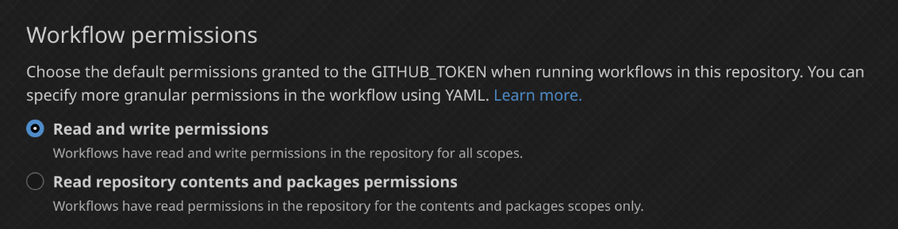

# action-upload-release

A small GitHub Action to upload build artifacts to releases.

## Requirements

**Read and write permissions are required.** Enable them in the Actions tab of
your repository settings.



## Usage

`.github/workflows/release.yml` example:

```yml
name: Build and upload release

on:
  release:
    types: [published]

jobs:
  build:
    uses: ./.github/workflows/build.yml

  upload:
    needs: build
    runs-on: ubuntu-latest
    steps:
      - uses: actions/download-artifact@v3
        with:
          name: dist # build output
          path: ./dist

      # tar is needed if you have a folder.
      - run: tar -czvf dist.tar.gz dist

      - uses: diamondburned@action-upload-release@main
        with:
          files: dist.tar.gz
```
